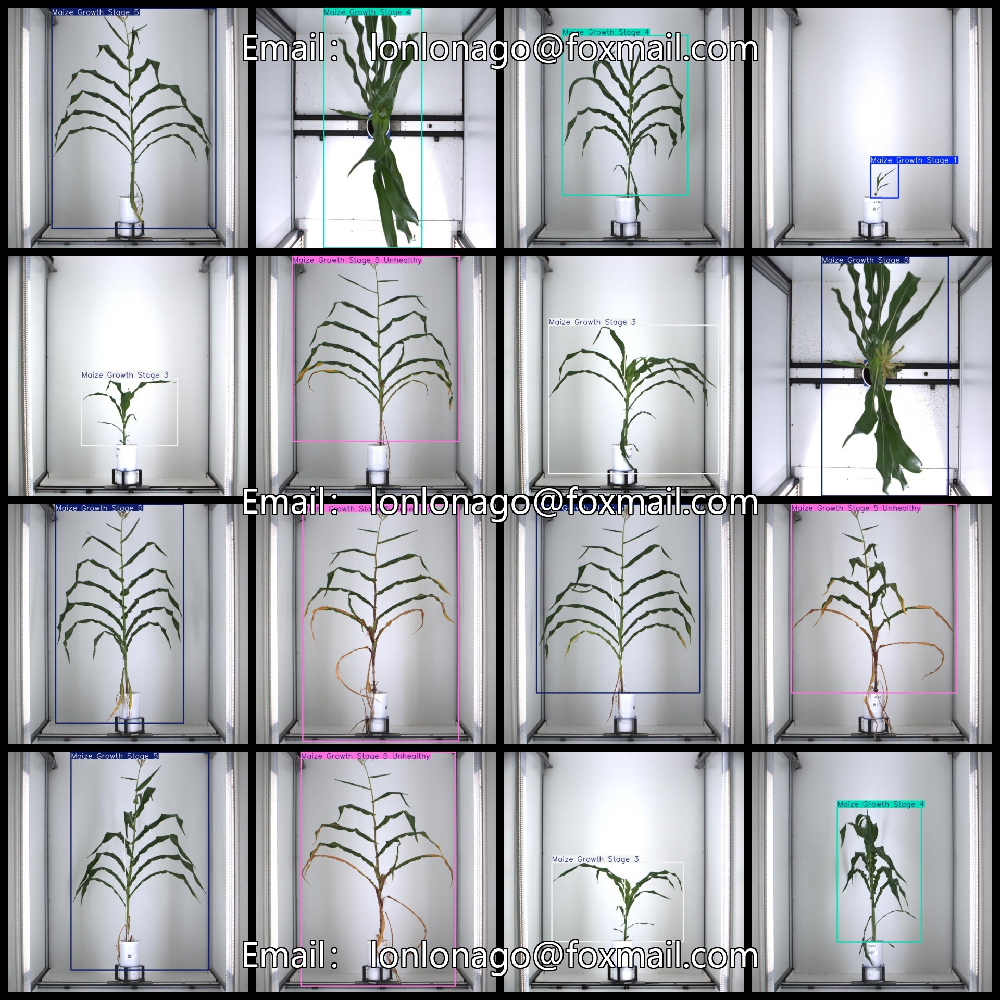
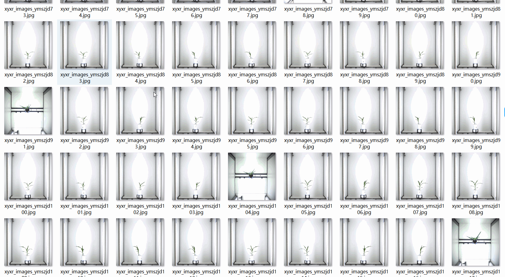

# Corn Growth Stage Detection Dataset 1482 imagesVOC+YOLO

Corn Growth Stage Detection Dataset 1482stretchVOC+YOLO

Dataset Format: VOC format + YOLO format

The compressed file contains: three folders, each storing images, xml files, and text files.

Total jpg images in JPEGImages folder: 1482

The total number of XML files in the Annotations folder is 1482.

The total number of txt files in the labels folder is 1482.

Number of tag types: 6

Tag names: ["Maize Growth Stage 1","Maize Growth Stage 2","Maize Growth Stage 3","Maize Growth Stage 4","Maize Growth Stage 5","Maize Growth Stage 5 Unhealthy"]

The number of boxes for each label (Note that the order of labels in the Yolo format does not correspond to this, but is based on the classes.txt file in the labels folder):

Maize Growth Stage 1 frame count = 51

Maize Growth Stage 2 frame count = 137

Maize Growth Stage 3 frame count = 197

Maize Growth Stage 4 frame count = 281

Maize Growth Stage 5 frame count = 312

Maize Growth Stage 5 Unhealthy frame count = 504

Total boxes: 1482

Picture clarity (Resolution: Pixels): Clear

Is the image enhanced: No

Shape of the label: Rectangular box, used for object detection and recognition.

Important Note: None

Special Notice: This dataset does not guarantee the accuracy or precision of the trained models or weight files. The dataset only provides accurate and reasonable annotations.

Annotation and image details are as follows:

## Images

---

Here is a pay link on Stripe (https://buy.stripe.com/3cs8yP7sY87d0vu9AB). Please contact me lonlonago@foxmail.com after funding $89, and I will send you a complete data files, thank you!

